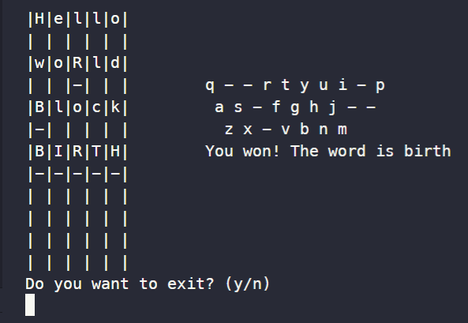

# Wordl

Guess a word in 6 tries.

- If a letter presents in a word, then it will be written in upper case

- If a letter is in the same position, then it will be underlined

Word is an 5-letter english noun.
Good luck

## Quick start

To play, go to a cmd folder:
```console
$ cd ./cmd
```

then run the program

```console
$ go run .
```

## Preview


